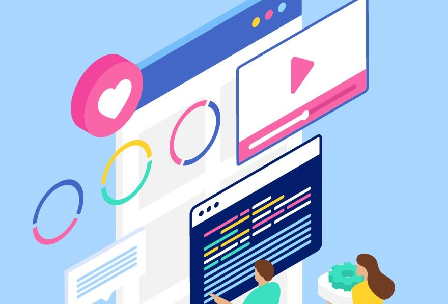

# link-repository
<h3>Este repositório foi criado para guardar links úteis para programadores</h3>

## Ideias de Projetos
<ul>
  <li><a href="https://github.com/florinpop17/app-ideas" rel="nofollow">App Ideas: Coleção de ideias de projetos divididas por dificuldade</a></li>
</ul>

## Inspiração para Design
<ul>
  <li><a href="https://dribbble.com/" rel="nofollow">Dribbble</a></li>
  <li><a href="https://www.designspiration.com/" rel="nofollow">Design Inspiration</a></li>
  <li><a href="https://www.awwwards.com/" rel="nofollow">Awwwards</a></li>
</ul>

## Ícones Gratuitos
<ul>
  <li><a href="https://www.flaticon.com/" rel="nofollow">Flat Icon</a></li>
  <li><a href="https://material.io/resources/icons/?style=baseline" rel="nofollow">Material Icons</a></li>
</ul>

## APIs Abertas
<ul>
  <li><a href="https://developer.marvel.com/docs/" rel="nofollow">Marvel API</a></li>
  <li><a href="https://pokeapi.co/" rel="nofollow">Poké API</a></li>
  <li><a href="https://api.github.com/users/carollira" rel="nofollow">Github</a></li>
</ul>

## Sites
<ul>
  <li><a href="https://archive.org/" rel="nofollow">Internet Archive: Biblioteca de sites, livros, música, software, filmes...</a></li>
  <li><a href="https://github.com/typicode/json-server" rel="nofollow">Gerar APIs Fakes pro seu projeto</a></li>
  <li><a href="https://www.uplabs.com/" rel="nofollow">UpLabs: Layouts gratuitos</a></li>
  <li><a href="https://www.w3schools.com/tags/ref_httpmessages.asp" rel="nofollow">Mensagens de status HTTP</a></li>
</ul>

<!--
<ul>
  <li></li>
</ul>
-->
